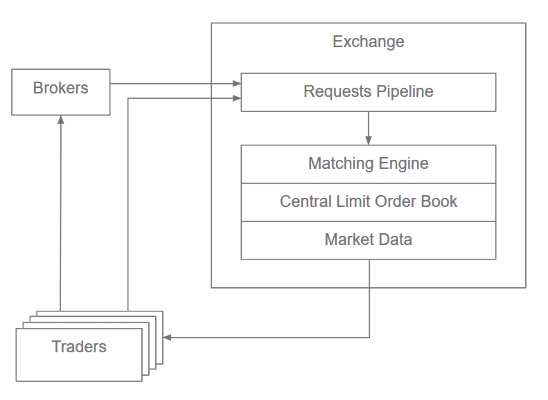
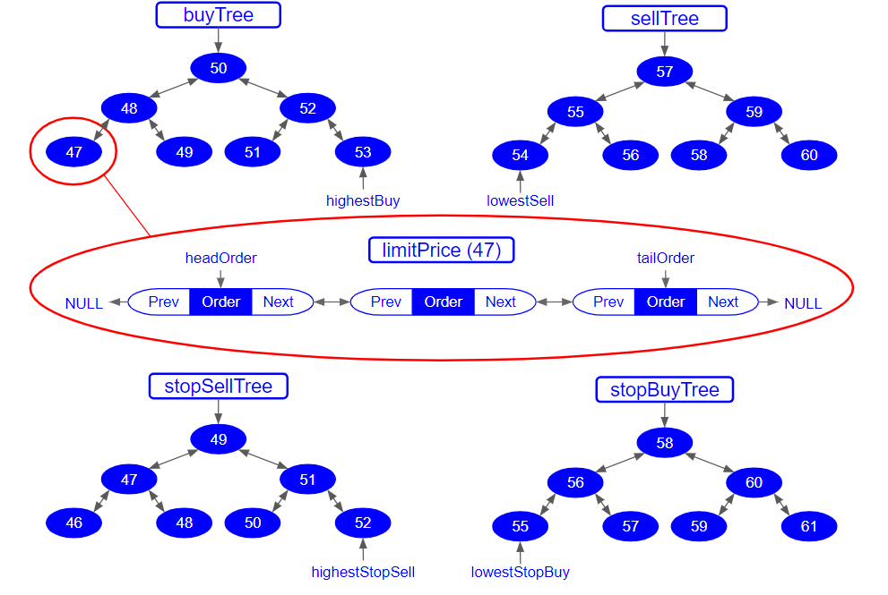
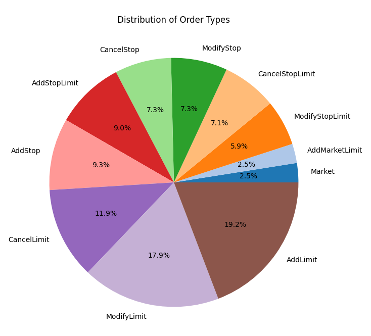
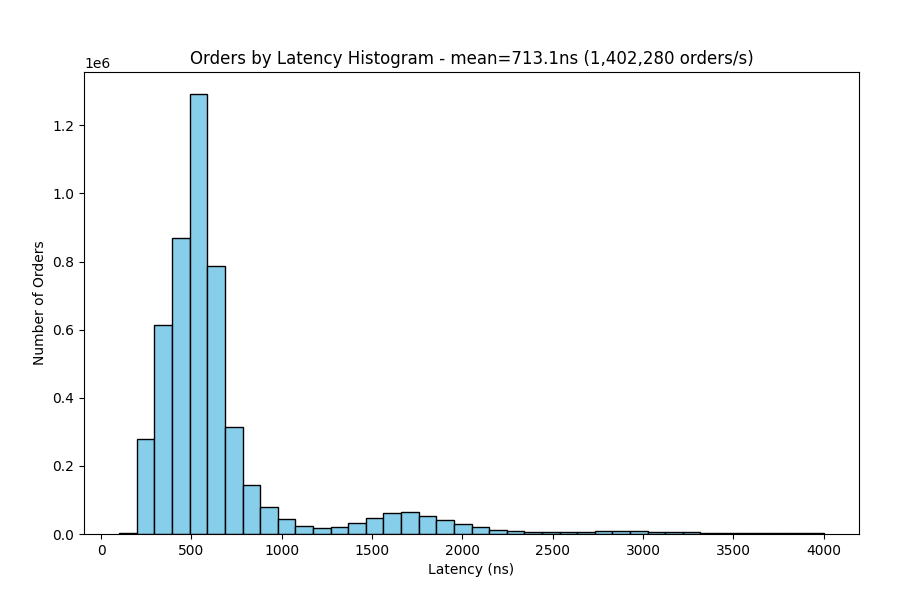
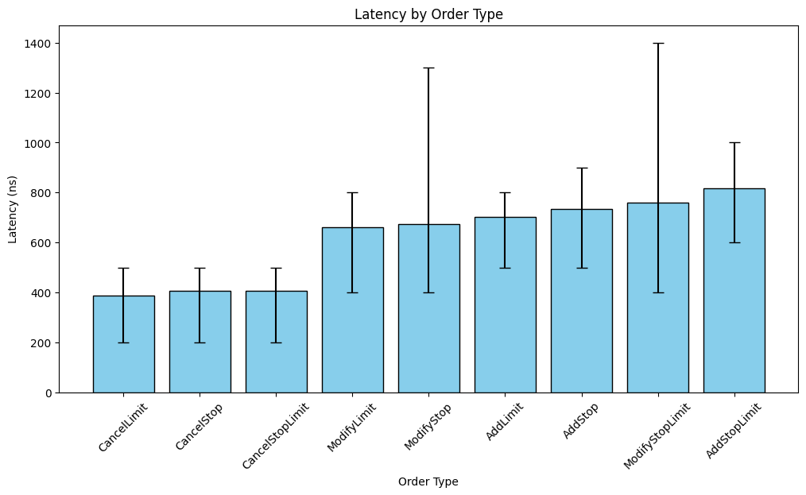
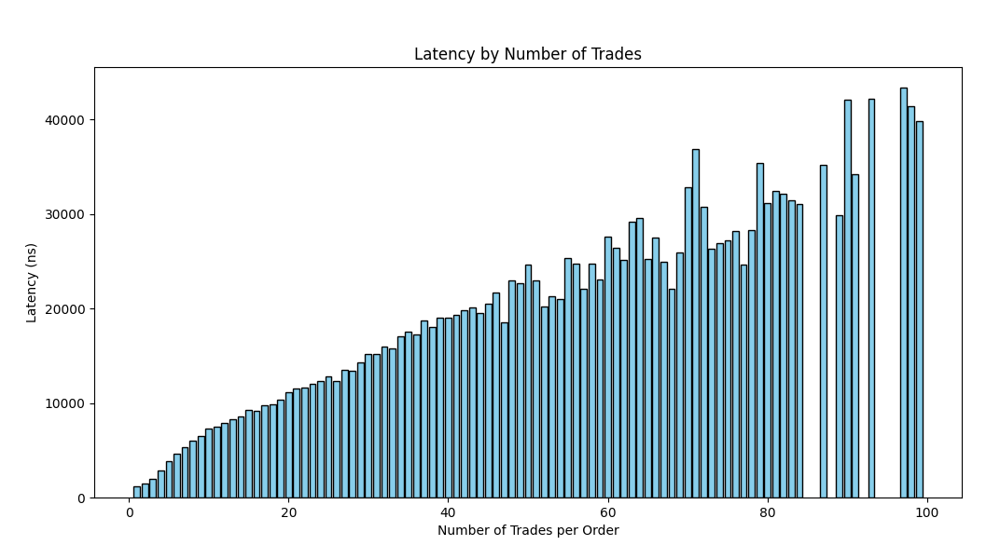
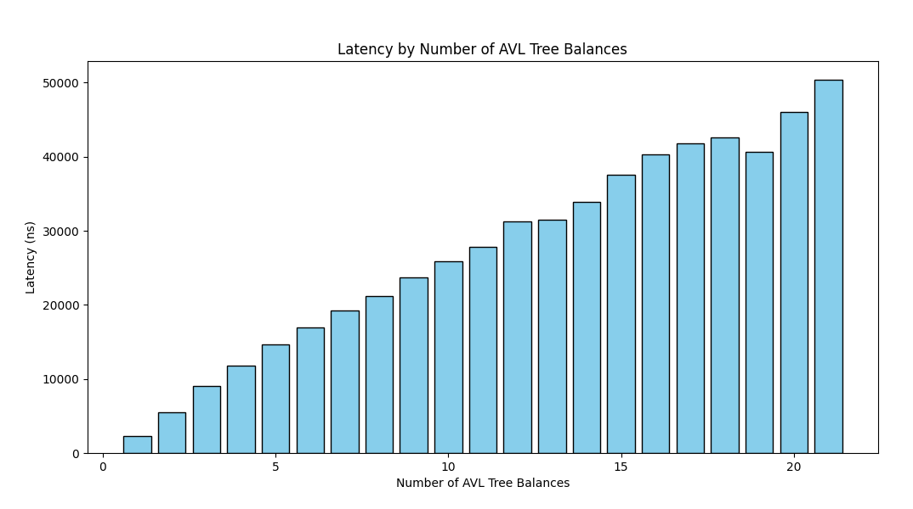
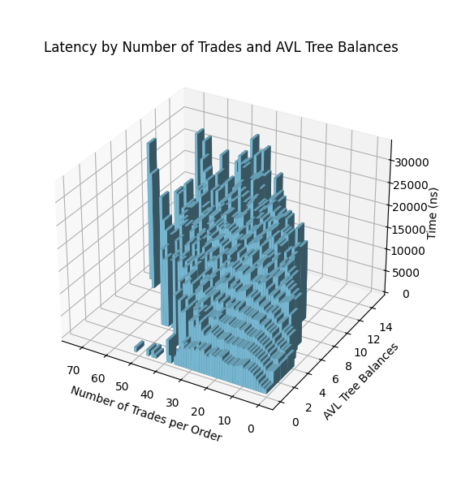

Limit Order Book

This project is a high-performance Limit Order Book (LOB) developed entirely in C++, capable of processing over 1.4 million transactions per second (TPS). It supports all major order types used in trading systems — including Market, Limit, Stop, and Stop Limit orders.

Performance testing was a key challenge, requiring the generation of large-scale order data, executing stress tests to measure latency, and analyzing the collected data through detailed visualizations. Comprehensive validation was performed using both unit tests and integration tests implemented with GoogleTest.

Background
Matching Engine

At the heart of every trading platform lies the matching engine, which processes orders by matching buyers and sellers according to price and time priority. It maintains a limit order book, containing all active orders that have not yet been executed.

Although multiple requests can be received in parallel, the matching of trades must occur sequentially, making the matching engine a bottleneck for throughput. Consequently, the overall capacity of an exchange — measured in orders per second — depends heavily on how efficiently the order book and matching logic operate.

The engine used in this project follows a FIFO (First-In, First-Out) and price-priority matching algorithm, mirroring the logic used in real-world exchanges. It also publishes market data updates such as trade executions and order book changes to simulate real-time market dynamics.

Order Types

The system supports all standard order types typically found in modern exchanges:

Market Order — Executes immediately at the best available price.

Limit Order (Add, Modify & Cancel) — Executes only when the market reaches the specified limit price.

Market Limit Order — Crosses the order book immediately to produce trades.

Stop Order (Add, Modify & Cancel) — Converts into a Market Order once the market crosses its stop price.

Stop Limit Order (Add, Modify & Cancel) — Converts into a Limit Order when the market crosses its stop price.

Project Structure
Limit_Order_Book/
├── Limit_Order_Book/        # Core LOB implementation
├── Generate_Orders/         # Order data generator
├── Process_Orders/          # Data processing and visualization
├── test/                    # Unit and integration tests
├── figures/                 # Figures for documentation
└── CMakeLists.txt

Architecture

The system is built around a binary tree of Limit objects sorted by limitPrice, each containing a doubly linked list of Order objects. Separate trees are maintained for buy and sell orders.

Pointers to highestBuy and lowestSell allow for constant-time access (O(1)) to the best bid and offer prices. Each order and limit is also indexed using hash maps for fast lookup.

Additionally, two more AVL trees and corresponding hash maps store stop and stop-limit orders, triggered when the market price crosses their respective stop levels.

This architecture allows efficient performance for all core operations:

Add Order – O(log M) for new limits; O(1) otherwise

Cancel/Modify Order – O(1)

Execute Order – O(1)

Get Best Bid/Offer – O(1)

The AVL trees ensure balance and consistent performance, even under dynamic market conditions.

Key assumptions:

All orders have positive share quantities.

Limit and stop prices are positive.

Order IDs are unique.

Testing & Performance
Test Data

A data generator was developed to simulate realistic order flow. It produced 5 million order requests, beginning with 11,000 initial orders to populate the book.

Order prices were normally distributed around a mean of 300 (σ = 50). Buy orders started below 300 and sell orders above, allowing the market center to shift dynamically during testing.

On average, the order book held 10,000 active limit orders and 1,000 stop or stop-limit orders at any time.

Latency Analysis

To measure throughput, timestamps were captured before and after each order was processed. Tests were conducted on an Intel i5-12450H (2.00 GHz) processor.

The histogram above shows processing times for 5 million orders. The average latency was 713 nanoseconds per order, equivalent to roughly 1.4 million TPS.

Among non-trade orders, Cancel Orders were the fastest (≈400ns), while adding or modifying Stop Limit Orders exhibited higher average latency and variance.

Latency increased linearly with the number of trades executed per order — approximately +440ns per additional trade.

Tree rebalancing during insertions and deletions also affected performance. Each additional AVL tree rebalance added roughly 2500ns to latency.

A combined analysis of executed trades and AVL rebalances showed both factors contributed to higher latency, with rebalancing having the stronger effect.

Conclusion

This Limit Order Book efficiently simulates high-frequency trading systems, achieving over 1.4 million orders per second through optimized data structures and algorithmic design.

Performance bottlenecks primarily stem from AVL tree rebalancing during heavy trading activity. Future improvements could focus on reducing these rebalances or leveraging faster CPUs to further enhance throughput.
